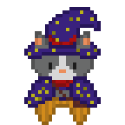

# Olá Amigos, Rafael Lima Aqui!

## Sobre mim
- **22 anos**.  
- Estudante de **Sistemas de Informação** na **Fundação Hermínio Ometto – FHO** *(início em 2024)*.  
- Apaixonado por tecnologia, programação, RPG e desenvolvimento de jogos.  
- Iniciei um projeto de **podcast** chamado **MimiCast**, onde exploro narrativas e conteúdos sobre RPG.

  

##  Habilidades
- **Linguagens & Tecnologias:**  
  - C (básico)  
  - HTML, CSS, JavaScript (básico)  
  - GameMakerLanguage - GML (básico)
  - Python *(iniciando)*  

- **Outros interesses:**  
  - Desenvolvento *Front-End* 
  - Criação de jogos 2D (GameMaker) 

## O que estou estudando atualmente
- **Python**
- **Front-End**  
- **GameMaker**

## Onde me encontrar

  
